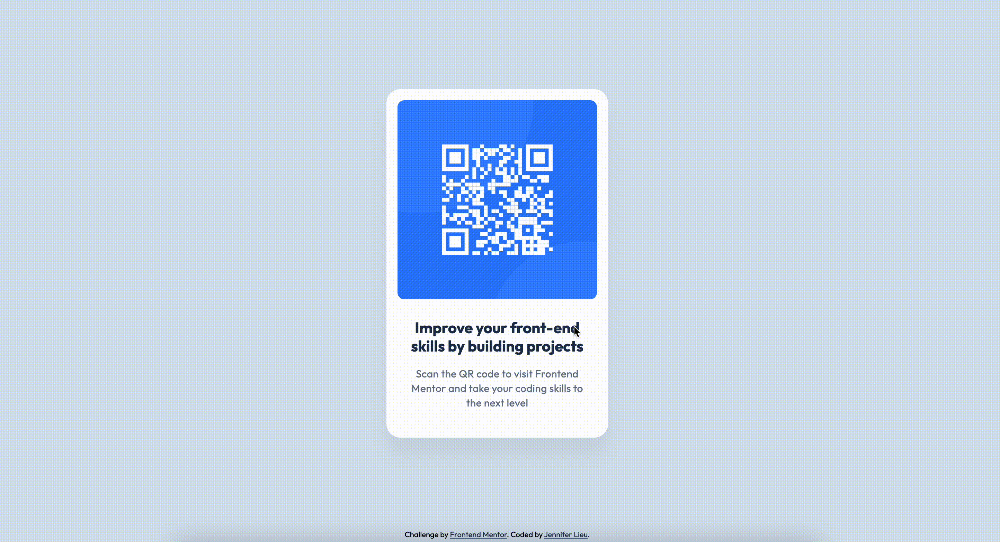

# Frontend Mentor - QR code component solution

Minimalist, responsive QR code component card.

## Table of Contents

- [Frontend Mentor - QR code component solution](#frontend-mentor---qr-code-component-solution)
  - [Table of Contents](#table-of-contents)
  - [Overview](#overview)
    - [Built with](#built-with)
    - [Features](#features)
    - [Project Structure](#project-structure)
  - [My Process](#my-process)
    - [What I learned](#what-i-learned)
    - [AI Collaboration](#ai-collaboration)
  - [Author](#author)
  - [Acknowledgments](#acknowledgments)


## Overview

<div align="center">

  

  [](https://jenniferlieu-sandbox.github.io/frontend-mentor/qr-code-component/)

</div>

### Built with

- Semantic HTML5 markup
- Component-scoped CSS custom properties
- Global design tokens
- Flexbox
- Mobile-first workflow
- Accessibilty in mind

### Features

- Responsive design
- Animated and clickable QR code
- Custom font [Outfit](https://fonts.google.com/specimen/Outfit)
- Themeable card component

### Project Structure

```markdown
qr-code-component
├── design-specs                  # Contains design specifications to convert to website 
│   ├── desktop-design.jpg        # Expected design for the desktop version
│   ├── mobile-design.jpg         # Expected design for the mobile version
│   └── style-guide.md            # Contains typography and colors used in the design

------------------------------------------------------------------------------------

├── images                        # Provided image assets for website
│   ├── favicon-32x32.png         # Website favicon image
│   └── image-qr-code.png         # Image of QR code
├── index.html                    # Main html for the website
├── styles.css                    # Styling for website

------------------------------------------------------------------------------------

├── .gitignore.md                 # Ignores design files and system files
├── AGENTS.md                     # Instructions for AI agents
├── CLAUDE.md                     # Instructions for Claude to use AGENTS.md
├── README.md                     # Overview of the project and learnings
└── screenshot.gif                # Animated screenshot of the QR code component
```

## My Process

### What I learned

- Learned to translate style guides and figma design files into a pixel-perfect web interfaces
- Learned the best practice for importing external font is to use the `<link>` tag in `<head>`
  - Browser can see both the font and the css stylesheet from the `html` file, allowing it to download both in parallel. Thus, speeidng up laod times and improving website performance.
  - `@import` is convenient, but requires the browser to download the stylesheet first, then the fonts after. Thus, slowing down load times and decreasing website performance.
- Learned to use AI agents with an instructions file `AGENTS.md`
- Learned to use a reduced-motion media query to disable animations for users who prefer reduced motion
  ```css
  @media (prefers-reduced-motion: reduce) {
    .card img {
        transition: none;
    }

    .card img:hover, .card img:active {
        transform: none;
    }
  }
  ```

### AI Collaboration

I asked VSCode's built-in Copilot to score my code out of 10 based on accessibility, responsiveness, semantics, best practices, coding conventions, and pixel perfect design. Copilot was able to review the code without issues and give feedback on improvements to reach a perfect score.

A happy accident - When checking for pixel-perfection, Copilot told me the intedned spacing between the elements within the card. This information is not listed under the [style guide](./design-specs/style-guide.md), only in the figma design file.

## Author

<a href="https://github.com/jenniferlieu">
  
  <p>
    @jenniferlieu
    <br>Coder
  </p>
</a>

## Acknowledgments

Frontend Mentor for providing [the challenge](https://www.frontendmentor.io/challenges/qr-code-component-iux_sIO_H)
